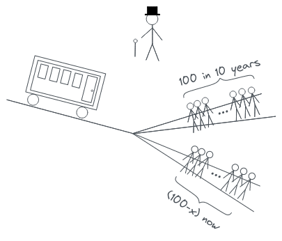

## About

This repository contains a minimalist trolley problem template, that can be edited using (the free version of) [excalidraw](https://excalidraw.com/). The reason for this is that the current default trolley problem template is too low-quality, and not really suitable for being edited and manipulated.

## Built With

- [Excalidraw](https://excalidraw.com/)

## Usage

Go to [excalidraw](https://excalidraw.com/), import the template, edit it, then export the template and the resulting image.

## Contributing

Contributions of new templates are welcome.

## License

Distributed under the MIT License.
